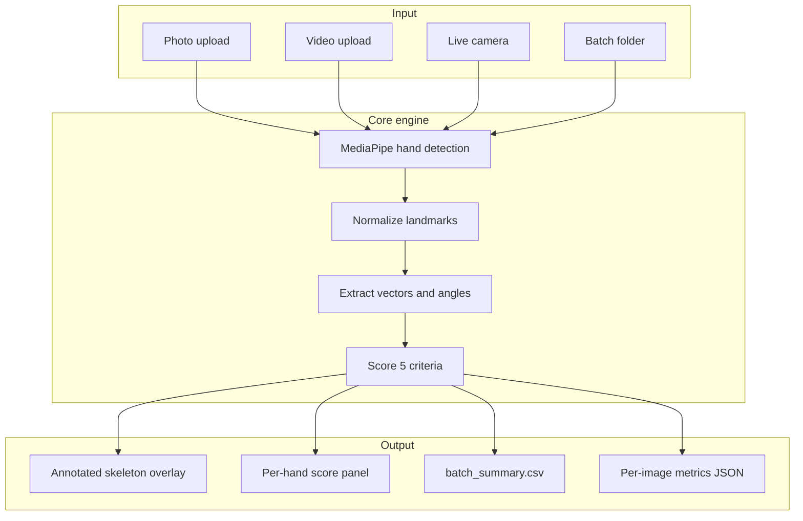

# Technique Titan

AI-powered piano hand posture analysis from a standard camera. Technique Titan
detects hand landmarks, measures five technique criteria with geometry-based
scoring, and surfaces per-hand results through a Streamlit UI or a batch CLI for
testers and researchers.

**Repository:** [github.com/defAaron/TechniqueTitan](https://github.com/defAaron/TechniqueTitan)

---

## The problem

Good piano technique depends heavily on hand posture. Collapsed wrists, flat
fingers, and tucked thumbs slow progress and can lead to strain over time. Today,
posture is corrected almost exclusively during in-person lessons:

- Students practice far more hours than they spend with a teacher, so bad habits
  form between sessions.
- Feedback is qualitative ("rounder fingers"), which is hard for beginners to
  internalize or track objectively.
- Self-taught learners and remote students often get no posture feedback at all.

Manually computing joint angles and vector positions for every training image is
also tedious and does not scale to large datasets.

## The solution

Technique Titan automates the full pipeline:

1. **Detect** 21 hand landmarks per hand with MediaPipe Hands.
2. **Normalize** coordinates (wrist origin, palm-span scale) so measurements are
   invariant to camera distance and hand size.
3. **Compute** vectors, joint angles, and per-criterion geometric metrics.
4. **Score** each criterion (0–100) and assign severity bands (good / warning /
   critical).
5. **Present** results via an interactive UI or export them as CSV/JSON for bulk
   analysis.

Both hands are detected and scored independently when visible in frame.

---

## Features

| Capability | Status |
|---|---|
| Photo upload review | Available (UI) |
| Video upload + posture timeline | Available (UI) |
| Live camera feedback | Available (local only) |
| Bulk image processing (CLI) | Available |
| Two-hand detection + separate scores | Available |
| Configurable scoring thresholds | Available (`config/scoring.yaml`) |
| Natural-language coaching text | Available (UI; YAML templates) |
| Progress tracking / accounts | Planned (Phase 3+) |

### Five posture criteria

| Criterion | What it measures |
|---|---|
| Wrist height | Wrist vs. knuckle line — not collapsed or over-lifted |
| Finger curvature | Natural curve vs. flat or over-clenched fingers |
| Thumb position | Thumb resting on its side vs. tucked or flared out |
| Wrist lateral deviation | Sideways ulnar/radial bend off a straight forearm line |
| Overall hand arch | Dome of the knuckle bridge vs. flat/collapsed hand |

Formulas and landmark inputs are documented in [docs/SCORING_METHODS.md](docs/SCORING_METHODS.md).

---

## Quick start

### Prerequisites

- Python 3.11 (MediaPipe `0.10.21` has no wheel for Python 3.13)
- macOS, Windows, or Linux
- Webcam (for live camera mode, local only)

### 1. Install

```bash
git clone https://github.com/defAaron/TechniqueTitan.git
cd TechniqueTitan

python3.11 -m venv .venv
source .venv/bin/activate        # Windows: .venv\Scripts\activate

pip install -e .
```

Live camera requires the **full** OpenCV build (not headless):

```bash
pip uninstall opencv-python-headless -y 2>/dev/null
pip install opencv-python==4.10.0.84
```

For tests only: `pip install -r requirements-dev.txt`

### 2. Run the UI (recommended)

```bash
streamlit run app.py
```

Open [http://localhost:8501](http://localhost:8501). Use the sidebar to switch modes:

| Mode | What you do | What you get |
|---|---|---|
| **Photo** | Upload a JPEG/PNG | Annotated overlay + per-hand score panel |
| **Video** | Upload MP4/MOV | Frame-by-frame overlay + per-hand timeline chart |
| **Live camera** | Click Start camera | Real-time overlay + live per-hand scores |

On macOS, grant camera access under **System Settings → Privacy & Security →
Camera** for Cursor or Terminal before using live mode.

### 3. Batch processing (testers / datasets)

Drop images into `data/raw/` (subfolders OK), then:

```bash
python -m technique_titan.batch.process_folder \
  --input data/raw \
  --output data/processed \
  --labels data/labels.csv   # optional
```

Outputs:

- `data/processed/batch_summary.csv` — one row per detected hand
- `data/processed/metrics/` — full vectors, angles, and scores per image
- `data/processed/outliers.csv` — auto-flagged suspicious rows

See [data/README.md](data/README.md) for the data intake guide.

---

## How it works



For each detected hand the pipeline:

1. Picks world landmarks when available (more stable 3D angles), otherwise image
   coordinates.
2. Resolves left/right labels; disambiguates collisions by wrist position when
   MediaPipe reports the same handedness for both hands.
3. Computes raw geometry for all five criteria, then maps metrics to scores using
   thresholds in `config/scoring.yaml`.
4. Colors the skeleton overlay by worst severity (green / orange / red) and tags
   each hand with `L` or `R`.

---

## Technical architecture

```
technique_titan/
├── app.py                    # Streamlit UI (photo, video, live)
├── config/scoring.yaml       # Tunable thresholds and weights
├── config/coaching.yaml      # Plain-language coaching templates
├── data/                     # Raw intake + processed outputs
├── docs/                     # PRD, roadmap, scoring formulas
├── scripts/                  # Early webcam prototypes
├── src/technique_titan/
│   ├── detection/            # MediaPipe wrapper (HandDetector)
│   ├── geometry/             # Vectors, angles, normalization
│   ├── features/             # One module per posture criterion
│   ├── analysis.py           # Single-frame / multi-hand analysis + overlays
│   ├── scoring.py            # Metric → score → severity mapping
│   ├── coaching.py           # Prioritized template coaching + tip highlights
│   └── batch/                # Bulk folder processor CLI
└── tests/                    # Unit tests (geometry, features, analysis)
```

### Tech stack

| Layer | Technology |
|---|---|
| Hand detection | MediaPipe Hands `0.10.21` (21 landmarks per hand) |
| Image/video I/O | OpenCV `4.x` |
| Math | NumPy |
| Scoring config | PyYAML |
| UI | Streamlit `1.30+` |
| Tests | pytest |

### Key modules

| Module | Role |
|---|---|
| `detection/hand_detector.py` | Wraps MediaPipe; returns landmarks, handedness, confidence |
| `geometry/vectors.py` | Joint angles, normalization, plane fitting |
| `features/*.py` | Per-criterion raw metric extractors |
| `scoring.py` | Piecewise-linear score mapping from `config/scoring.yaml` |
| `analysis.py` | `analyze_hands()`, overlay drawing, label disambiguation |
| `batch/process_folder.py` | Walks `data/raw/`, writes CSV/JSON exports |

---

## Deployment

### Local (all 3 UI modes)

```bash
pip install -e .
pip install opencv-python==4.10.0.84
streamlit run app.py
```

Photo, video, and live camera all work locally.

### Streamlit Community Cloud (photo + video only)

1. Deploy from [share.streamlit.io](https://share.streamlit.io) using repo
   `defAaron/TechniqueTitan`, branch `main`, entrypoint `app.py`.
2. Set **Python version to 3.11** in Advanced settings.
3. Dependencies install from `requirements.txt`; system libs from `packages.txt`.

Live camera does **not** work on Streamlit Cloud — the server has no webcam.
Use local deployment or a future WebRTC-based live mode for hosted real-time
feedback.

---

## Development

```bash
# Run tests
pytest

# Run batch smoke test
python -m technique_titan.batch.process_folder \
  --input data/raw --output data/processed
```

### Project conventions

- Scoring thresholds live in `config/scoring.yaml` — tune without code changes.
- The batch CLI is for bulk data; the Streamlit UI is for one-at-a-time review.
- Legacy prototypes are preserved under `legacy/pycharm/` and `scripts/`.

---

## Documentation

| Document | Description |
|---|---|
| [docs/PRD.md](docs/PRD.md) | Product requirements and personas |
| [docs/ROADMAP.md](docs/ROADMAP.md) | Phased delivery plan |
| [docs/SCORING_METHODS.md](docs/SCORING_METHODS.md) | Formulas and landmark inputs per criterion |
| [data/README.md](data/README.md) | Tester data intake and output schema |

---

## Roadmap (summary)

| Phase | Focus |
|---|---|
| 0 — Foundation | Project structure, tests, data strategy |
| 1 — Core detection | Geometry scoring engine (current) |
| 2 — Feedback engine | Plain-language coaching text (shipped: templates + UI) |
| 3 — Product surface | Web UI, persistence, progress charts |
| 4 — Intelligence | Piano-specific model, teacher/student roles |

Full detail in [docs/ROADMAP.md](docs/ROADMAP.md).

---

## License

No license file is specified yet. Contact the repository owner for usage terms.
