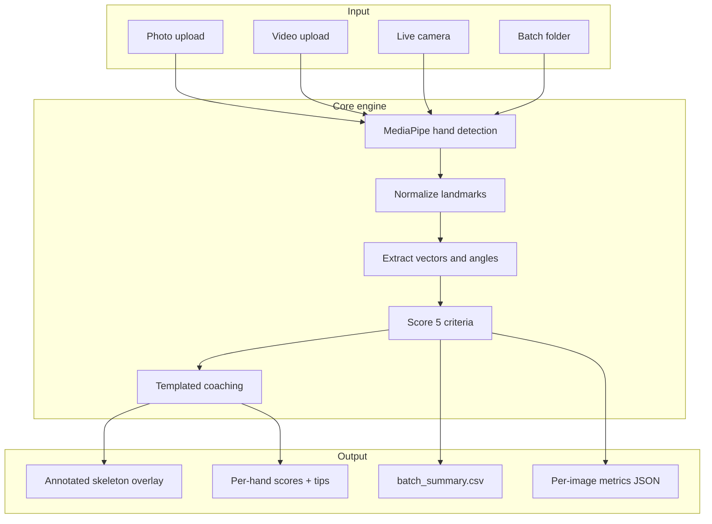

<a id="readme-top"></a>

<br />
<div align="center">
  <a href="https://github.com/defAaron/TechniqueTitan">
    
  </a>

  <h3 align="center">Technique Titan</h3>

  <p align="center">
    AI piano posture coach that turns a laptop camera into on-demand technique feedback.
    <br />
    <a href="https://github.com/defAaron/TechniqueTitan/blob/main/docs/PRD.md"><strong>Explore the docs »</strong></a>
    <br />
    <br />
    <a href="https://technique-titan.vercel.app">View Demo</a>
    &middot;
    <a href="https://github.com/defAaron/TechniqueTitan/issues/new">Report Bug</a>
    &middot;
    <a href="https://github.com/defAaron/TechniqueTitan/issues/new">Request Feature</a>
  </p>
</div>

<details>
  <summary>Table of Contents</summary>
  <ol>
    <li>
      <a href="#about-the-project">About The Project</a>
      <ul>
        <li><a href="#built-with">Built With</a></li>
      </ul>
    </li>
    <li>
      <a href="#getting-started">Getting Started</a>
      <ul>
        <li><a href="#prerequisites">Prerequisites</a></li>
        <li><a href="#installation">Installation</a></li>
      </ul>
    </li>
    <li><a href="#usage">Usage</a></li>
    <li><a href="#roadmap">Roadmap</a></li>
    <li><a href="#license">License</a></li>
    <li><a href="#contact">Contact</a></li>
    <li><a href="#acknowledgments">Acknowledgments</a></li>
  </ol>
</details>

<!-- ABOUT THE PROJECT -->
## About The Project

[![Product screenshot][product-screenshot]](https://technique-titan.vercel.app)

Technique Titan detects 21 MediaPipe landmarks per hand, scores five geometry-based criteria (0–100), and returns prioritized coaching through a React + FastAPI product — plus Streamlit and a batch CLI for demos and research.

Here's why:

* Students practice far more hours than they spend with a teacher, so collapsed wrists, flat fingers, and tucked thumbs form between lessons.
* Feedback is usually qualitative ("rounder fingers"), which is hard for beginners to internalize or track objectively.
* Self-taught learners and remote students often get no posture feedback at all.
* Manually computing joint angles for every training image does not scale to large datasets.

Technique Titan automates the full pipeline:

1. **Detect** 21 hand landmarks per hand with MediaPipe Hands.
2. **Normalize** coordinates (wrist origin, palm-span scale) so measurements are invariant to camera distance and hand size.
3. **Compute** vectors, joint angles, and per-criterion geometric metrics.
4. **Score** each criterion (0–100) and assign severity bands (good / warning / critical).
5. **Coach** with plain-language tips from YAML templates, prioritized by severity.
6. **Present** results in the web UI, Streamlit, or CSV/JSON for bulk analysis.

Both hands are detected and scored independently when visible in frame.

| Capability | Status |
|---|---|
| Photo upload review | Available (React + Streamlit) |
| Video upload + posture timeline | Available (React + Streamlit) |
| Live camera feedback | Available (React browser MediaPipe; local Streamlit OpenCV) |
| REST analyze API | Available (`api/`) |
| Templated coaching tips | Available (`config/coaching.yaml`) |
| Bulk image processing (CLI) | Available |
| Two-hand detection + separate scores | Available |
| Configurable scoring thresholds | Available (`config/scoring.yaml`) |
| Progress tracking / accounts | Planned (Phase 3 remainder / Phase 4) |

### Five posture criteria

| Criterion | What it measures |
|---|---|
| Wrist height | Wrist vs. knuckle line — not collapsed or over-lifted |
| Finger curvature | Natural curve vs. flat or over-clenched fingers |
| Thumb position | Thumb resting on its side vs. tucked or flared out |
| Wrist lateral deviation | Sideways ulnar/radial bend off a straight forearm line |
| Overall hand arch | Dome of the knuckle bridge vs. flat/collapsed hand |

Formulas and landmark inputs are documented in [docs/SCORING_METHODS.md](docs/SCORING_METHODS.md).

<p align="right">(<a href="#readme-top">back to top</a>)</p>

### Built With

* [![Python][Python]][Python-url]
* [![React][React.js]][React-url]
* [![TypeScript][TypeScript]][TypeScript-url]
* [![FastAPI][FastAPI]][FastAPI-url]
* [![Vite][Vite]][Vite-url]
* [![Tailwind CSS][Tailwind]][Tailwind-url]
* [![MediaPipe][MediaPipe]][MediaPipe-url]
* [![OpenCV][OpenCV]][OpenCV-url]
* [![Streamlit][Streamlit]][Streamlit-url]

| Layer | Technology |
|---|---|
| Hand detection (server) | MediaPipe Hands `0.10.21` (21 landmarks per hand) |
| Hand detection (browser live) | `@mediapipe/tasks-vision` |
| Image/video I/O | OpenCV `4.10` |
| Math | NumPy `1.26+` (&lt;2) |
| Scoring / coaching config | PyYAML |
| Product API | FastAPI + Uvicorn + Pydantic 2 |
| Product UI | React 19 + TypeScript + Vite 8 + Tailwind 4 |
| Charts / WebGL | Recharts, OGL |
| Interim UI | Streamlit `1.30+` |
| Deploy | Render (API Docker), Vercel (web), Streamlit Cloud (interim) |
| CI | GitHub Actions (pytest + `npm run build`) |
| Tests | pytest + httpx |

<p align="right">(<a href="#readme-top">back to top</a>)</p>

<!-- GETTING STARTED -->
## Getting Started

To get a local copy up and running, follow these steps.

### Prerequisites

* **Python 3.11** (MediaPipe `0.10.21` has no wheel for Python 3.13)
* **Node.js 22+** (for the React UI)
* macOS, Windows, or Linux
* Webcam (for live mode)

### Installation

The product stack (React UI + FastAPI) is the recommended local setup.

1. Clone the repo
   ```sh
   git clone https://github.com/defAaron/TechniqueTitan.git
   cd TechniqueTitan
   ```
2. Create a Python 3.11 virtualenv and install the package with API extras
   ```sh
   python3.11 -m venv .venv
   source .venv/bin/activate        # Windows: .venv\Scripts\activate
   pip install -e ".[api]"
   ```
3. Start the API on port 8000
   ```sh
   uvicorn api.main:app --reload --port 8000
   ```
4. Install JS packages and start the React UI
   ```sh
   cd web
   npm install
   npm run dev
   ```
5. Open [http://localhost:5173](http://localhost:5173)

Vite proxies `/v1/*` to the API. Missing API on `:8000` produces a Vite **502**.

<p align="right">(<a href="#readme-top">back to top</a>)</p>

<!-- USAGE EXAMPLES -->
## Usage

### Product UI

| Route | Mode |
|---|---|
| `/photo` | Upload JPEG/PNG → overlay + scores + coaching |
| `/video` | Upload MP4/MOV → frame scores + posture timeline |
| `/live` | Browser camera → landmarks (fast) or frame upload |
| `/about` | How the scoring engine works |

Live mode on the React UI prefers **browser-side MediaPipe** (`@mediapipe/tasks-vision`) and posts compact landmarks to `POST /v1/score/landmarks` so video stays on-device. Frame-upload mode (`POST /v1/analyze/frame`) is available as a fallback.

### Streamlit UI (interim / research)

```sh
pip install -e .
# Live camera needs the full OpenCV build (not headless):
pip uninstall opencv-python-headless -y 2>/dev/null
pip install opencv-python==4.10.0.84

streamlit run app.py
```

Open [http://localhost:8501](http://localhost:8501). Sidebar modes: Photo, Video, Live camera.

On macOS, grant camera access under **System Settings → Privacy & Security → Camera** for Cursor or Terminal before using live mode.

### Batch processing (testers / datasets)

```sh
pip install -e .
# For tests: pip install -r requirements-dev.txt
```

Drop images into `data/raw/` (subfolders OK; e.g. `excellent/1.png`, `good/2.png`), then:

```sh
python -m technique_titan.batch.process_folder \
  --input data/raw \
  --output data/processed \
  --labels data/labels.csv   # optional — export from Notion labeling table
```

**Expert labels** are maintained in the **Notion** page `techniquetitan` (classification table). Agents with Notion MCP can read/update that table to complete labeling; export to `data/labels.csv` when running batch scoring. See [data/README.md](data/README.md) and [AGENTS.md](AGENTS.md).

Outputs:

- `data/processed/batch_summary.csv` — one row per detected hand
- `data/processed/metrics/` — full vectors, angles, and scores per image
- `data/processed/outliers.csv` — auto-flagged suspicious rows

### How it works


```mermaid
flowchart TD
    subgraph input [Input]
        Photo[Photo upload]
        Video[Video upload]
        Live[Live camera]
        Batch[Batch folder]
    end

    subgraph engine [Core engine]
        Detect[MediaPipe hand detection]
        Norm[Normalize landmarks]
        Features[Extract vectors and angles]
        Score[Score 5 criteria]
        Coach[Templated coaching]
    end

    subgraph output [Output]
        Overlay[Annotated skeleton overlay]
        Panel[Per-hand scores + tips]
        CSV[batch_summary.csv]
        JSON[Per-image metrics JSON]
    end

    Photo --> Detect
    Video --> Detect
    Live --> Detect
    Batch --> Detect
    Detect --> Norm --> Features --> Score --> Coach
    Coach --> Overlay
    Coach --> Panel
    Score --> CSV
    Score --> JSON
```

For each detected hand the pipeline:

1. Picks world landmarks when available (more stable 3D angles), otherwise image coordinates.
2. Resolves left/right labels; disambiguates collisions by wrist position when MediaPipe reports the same handedness for both hands.
3. Computes raw geometry for all five criteria, then maps metrics to scores using thresholds in `config/scoring.yaml`.
4. Generates prioritized coaching tips from `config/coaching.yaml`.
5. Colors the skeleton overlay by worst severity (green / orange / red) and tags each hand with `L` or `R`.

### Architecture

```
technique_titan/
├── api/                      # FastAPI product backend (uvicorn api.main:app)
├── web/                      # React + TypeScript + Tailwind product UI (Vercel root)
│   └── src/
│       ├── components/
│       │   ├── layout/       # chrome (Layout, ApiStatusBanner)
│       │   ├── marketing/    # landing (Hero, KeyFeatures, PipelineFlow, VideoPreview)
│       │   ├── analyze/      # results (ScorePanel, CoachingTips, OverlayImage)
│       │   └── ui/           # primitives (Reveal, SpecularButton)
│       ├── pages/
│       └── lib/
├── src/technique_titan/      # Core library (detect → features → score → coach)
│   ├── detection/
│   ├── geometry/
│   ├── features/
│   ├── batch/                # Bulk folder processor CLI
│   ├── analysis.py
│   ├── scoring.py
│   └── coaching.py
├── assets/brand/             # Master brand icon (favicons derived in web/public)
├── config/                   # scoring.yaml + coaching.yaml
├── data/
│   ├── raw/                  # Labeled set: excellent|good|warning|critical
│   ├── fixtures/             # Local smoke images (not labeled)
│   └── processed/            # Batch outputs (gitignored)
├── docs/
│   ├── archive/              # Research notes / historical artifacts
│   ├── PRD.md
│   ├── ROADMAP.md
│   ├── SCORING_METHODS.md
│   ├── DEPLOY.md
│   └── errors.md
├── tests/
│   ├── engine/               # Core library unit tests
│   └── api/                  # FastAPI tests
├── notebooks/
├── app.py                    # Streamlit UI (interim / Cloud demo) — keep at repo root
├── Dockerfile                # API image (Render) — keep at repo root
├── render.yaml               # Render Blueprint (optional)
├── pyproject.toml
├── requirements.txt          # Streamlit Cloud
├── requirements-api.txt      # Docker / API
└── requirements-dev.txt      # Local tests
```

| Module | Role |
|---|---|
| `detection/hand_detector.py` | Wraps MediaPipe; returns landmarks, handedness, confidence |
| `geometry/vectors.py` | Joint angles, normalization, plane fitting |
| `features/*.py` | Per-criterion raw metric extractors |
| `scoring.py` | Piecewise-linear score mapping from `config/scoring.yaml` |
| `coaching.py` | Templated tips from `config/coaching.yaml` |
| `analysis.py` | `analyze_hands()`, overlay drawing, label disambiguation |
| `batch/process_folder.py` | Walks `data/raw/`, writes CSV/JSON exports |

### API surface

| Method | Path | Purpose |
|---|---|---|
| `POST` | `/v1/analyze/image` | Photo analysis (max 8 MB) |
| `POST` | `/v1/analyze/frame` | Live JPEG frame (max 8 MB) |
| `POST` | `/v1/analyze/video` | Video analysis (max 40 MB) |
| `POST` | `/v1/score/landmarks` | Score browser-extracted landmarks |
| `GET` | `/v1/health` | Healthcheck |
| `GET` | `/v1/config/public` | Public criterion labels + modes |

OpenAPI docs: `http://127.0.0.1:8000/docs` when the API is running.

### Deployment

See **[docs/DEPLOY.md](docs/DEPLOY.md)** for Render + Vercel + Streamlit Cloud.

| Surface | Host |
|---|---|
| Product UI (`web/`) | [Vercel](https://technique-titan.vercel.app) |
| Product API (`api/`) | [Render](https://technique-titan-api.onrender.com) (Docker) |
| Interim demo (`app.py`) | Streamlit Community Cloud |

Live camera does **not** work on Streamlit Cloud (no webcam on the server). Use the React **Live** page for hosted real-time feedback.

### Development

```sh
# Python tests
pip install -e ".[api]"
pip install -r requirements-dev.txt
pytest

# Web
cd web && npm ci && npm run lint && npm run build

# Batch smoke test
python -m technique_titan.batch.process_folder \
  --input data/raw --output data/processed
```

Project conventions:

* Scoring thresholds live in `config/scoring.yaml` — tune without code changes.
* Coaching copy lives in `config/coaching.yaml` — templates, not an LLM.
* The batch CLI is for bulk data; the React UI is for interactive review.
* Prefer Python **3.11** in all environments (CI, Docker, Streamlit Cloud).

### Documentation

| Document | Description |
|---|---|
| [docs/PRD.md](docs/PRD.md) | Product requirements and personas |
| [docs/ROADMAP.md](docs/ROADMAP.md) | Phased delivery plan |
| [docs/SCORING_METHODS.md](docs/SCORING_METHODS.md) | Formulas and landmark inputs per criterion |
| [docs/DEPLOY.md](docs/DEPLOY.md) | Render + Vercel + Streamlit Cloud deploy guide |
| [docs/errors.md](docs/errors.md) | Chronological error history — agents must check before new work |
| [web/README.md](web/README.md) | React UI develop / build notes |
| [data/README.md](data/README.md) | Dataset intake for batch runs |

_For more examples, please refer to the [Documentation](docs/PRD.md)._

<p align="right">(<a href="#readme-top">back to top</a>)</p>

<!-- ROADMAP -->
## Roadmap

- [x] Phase 0 — Foundation: project structure, tests, data strategy
- [x] Phase 1 — Core detection: geometry scoring engine
- [x] Phase 2 — Feedback engine: templated coaching + overlays
- [x] Phase 3a — Product surface: React UI + API (photo / video / live)
- [ ] Phase 3b — Persistence: session history and progress charts
- [ ] Phase 4 — Intelligence
  - [ ] Piano-specific model
  - [ ] Teacher / student roles
- [ ] Phase 5 — Scale & polish: performance, accessibility, monetization, observability

See [docs/ROADMAP.md](docs/ROADMAP.md) for full detail, and the [open issues](https://github.com/defAaron/TechniqueTitan/issues) for proposed features and known issues.

<p align="right">(<a href="#readme-top">back to top</a>)</p>

<!-- LICENSE -->
## License

No license file is specified yet. Contact the repository owner for usage terms.

<p align="right">(<a href="#readme-top">back to top</a>)</p>

<!-- CONTACT -->
## Contact

Aaron — [defAaron](https://github.com/defAaron)

Project Link: [https://github.com/defAaron/TechniqueTitan](https://github.com/defAaron/TechniqueTitan)

<p align="right">(<a href="#readme-top">back to top</a>)</p>

<!-- ACKNOWLEDGMENTS -->
## Acknowledgments

* [MediaPipe Hands](https://ai.google.dev/edge/mediapipe/solutions/vision/hand_landmarker)
* [OpenCV](https://opencv.org/)
* [FastAPI](https://fastapi.tiangolo.com/)
* [React](https://react.dev/)
* [Streamlit](https://streamlit.io/)
* [Best-README-Template](https://github.com/othneildrew/Best-README-Template)
* [Img Shields](https://shields.io)
* [Choose an Open Source License](https://choosealicense.com)

<p align="right">(<a href="#readme-top">back to top</a>)</p>

<!-- MARKDOWN LINKS & IMAGES -->
[product-screenshot]: web/public/landing/pianist.jpg
[Python]: https://img.shields.io/badge/Python-3776AB?style=for-the-badge&logo=python&logoColor=white
[Python-url]: https://www.python.org/
[React.js]: https://img.shields.io/badge/React-20232A?style=for-the-badge&logo=react&logoColor=61DAFB
[React-url]: https://react.dev/
[TypeScript]: https://img.shields.io/badge/TypeScript-007ACC?style=for-the-badge&logo=typescript&logoColor=white
[TypeScript-url]: https://www.typescriptlang.org/
[FastAPI]: https://img.shields.io/badge/FastAPI-009688?style=for-the-badge&logo=fastapi&logoColor=white
[FastAPI-url]: https://fastapi.tiangolo.com/
[Vite]: https://img.shields.io/badge/Vite-646CFF?style=for-the-badge&logo=vite&logoColor=white
[Vite-url]: https://vite.dev/
[Tailwind]: https://img.shields.io/badge/Tailwind_CSS-38B2AC?style=for-the-badge&logo=tailwind-css&logoColor=white
[Tailwind-url]: https://tailwindcss.com/
[MediaPipe]: https://img.shields.io/badge/MediaPipe-009688?style=for-the-badge&logo=google&logoColor=white
[MediaPipe-url]: https://ai.google.dev/edge/mediapipe
[OpenCV]: https://img.shields.io/badge/OpenCV-5C3EE8?style=for-the-badge&logo=opencv&logoColor=white
[OpenCV-url]: https://opencv.org/
[Streamlit]: https://img.shields.io/badge/Streamlit-FF4B4B?style=for-the-badge&logo=streamlit&logoColor=white
[Streamlit-url]: https://streamlit.io/
