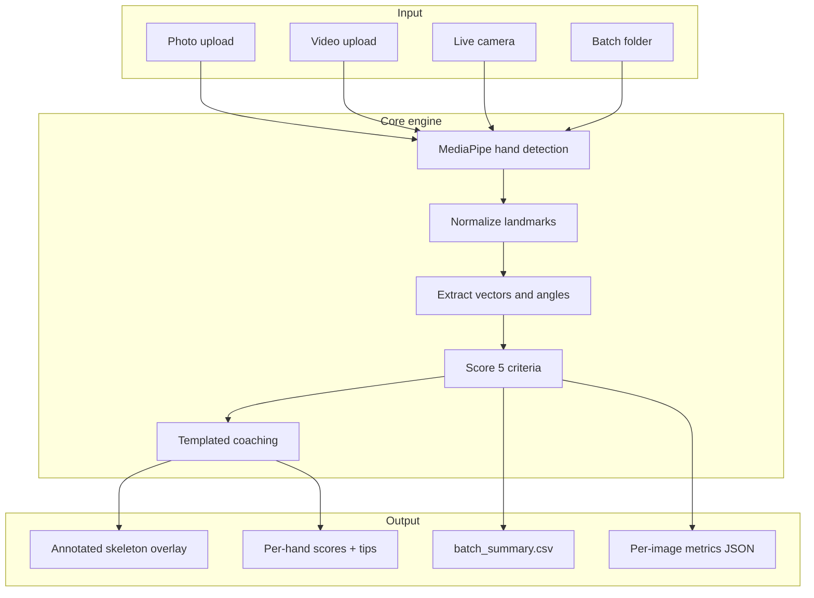

# Technique Titan

AI piano posture coach that turns a laptop camera into on-demand technique
feedback. Detects 21 MediaPipe landmarks per hand, scores five geometry-based
criteria (0–100), and returns prioritized coaching via a React + FastAPI
product — plus Streamlit and a batch CLI for demos and research.

**Repository:** [github.com/defAaron/TechniqueTitan](https://github.com/defAaron/TechniqueTitan)

---

## The problem

Good piano technique depends heavily on hand posture. Collapsed wrists, flat
fingers, and tucked thumbs slow progress and can lead to strain over time. Today,
posture is corrected almost exclusively during in-person lessons:

- Students practice far more hours than they spend with a teacher, so bad habits
  form between sessions.
- Feedback is qualitative ("rounder fingers"), which is hard for beginners to
  internalize or track objectively.
- Self-taught learners and remote students often get no posture feedback at all.

Manually computing joint angles and vector positions for every training image is
also tedious and does not scale to large datasets.

## The solution

Technique Titan automates the full pipeline:

1. **Detect** 21 hand landmarks per hand with MediaPipe Hands.
2. **Normalize** coordinates (wrist origin, palm-span scale) so measurements are
   invariant to camera distance and hand size.
3. **Compute** vectors, joint angles, and per-criterion geometric metrics.
4. **Score** each criterion (0–100) and assign severity bands (good / warning /
   critical).
5. **Coach** with plain-language tips from YAML templates, prioritized by severity.
6. **Present** results in the web UI, Streamlit, or CSV/JSON for bulk analysis.

Both hands are detected and scored independently when visible in frame.

---

## Features

| Capability | Status |
|---|---|
| Photo upload review | Available (React + Streamlit) |
| Video upload + posture timeline | Available (React + Streamlit) |
| Live camera feedback | Available (React browser MediaPipe; local Streamlit OpenCV) |
| REST analyze API | Available (`api/`) |
| Templated coaching tips | Available (`config/coaching.yaml`) |
| Bulk image processing (CLI) | Available |
| Two-hand detection + separate scores | Available |
| Configurable scoring thresholds | Available (`config/scoring.yaml`) |
| Progress tracking / accounts | Planned (Phase 3 remainder / Phase 4) |

### Five posture criteria

| Criterion | What it measures |
|---|---|
| Wrist height | Wrist vs. knuckle line — not collapsed or over-lifted |
| Finger curvature | Natural curve vs. flat or over-clenched fingers |
| Thumb position | Thumb resting on its side vs. tucked or flared out |
| Wrist lateral deviation | Sideways ulnar/radial bend off a straight forearm line |
| Overall hand arch | Dome of the knuckle bridge vs. flat/collapsed hand |

Formulas and landmark inputs are documented in [docs/SCORING_METHODS.md](docs/SCORING_METHODS.md).

---

## Quick start

### Prerequisites

- **Python 3.11** (MediaPipe `0.10.21` has no wheel for Python 3.13)
- **Node.js 22+** (for the React UI)
- macOS, Windows, or Linux
- Webcam (for live mode)

### Product stack (recommended)

```bash
git clone https://github.com/defAaron/TechniqueTitan.git
cd TechniqueTitan

python3.11 -m venv .venv
source .venv/bin/activate        # Windows: .venv\Scripts\activate

pip install -e ".[api]"

# Terminal 1 — API
uvicorn api.main:app --reload --port 8000

# Terminal 2 — React UI
cd web && npm install && npm run dev
```

Open [http://localhost:5173](http://localhost:5173). Vite proxies `/v1/*` to the API.

| Route | Mode |
|---|---|
| `/photo` | Upload JPEG/PNG → overlay + scores + coaching |
| `/video` | Upload MP4/MOV → frame scores + posture timeline |
| `/live` | Browser camera → landmarks (fast) or frame upload |
| `/about` | How the scoring engine works |

### Streamlit UI (interim / research)

```bash
pip install -e .
# Live camera needs the full OpenCV build (not headless):
pip uninstall opencv-python-headless -y 2>/dev/null
pip install opencv-python==4.10.0.84

streamlit run app.py
```

Open [http://localhost:8501](http://localhost:8501). Sidebar modes: Photo, Video, Live camera.

On macOS, grant camera access under **System Settings → Privacy & Security →
Camera** for Cursor or Terminal before using live mode.

### Batch processing (testers / datasets)

```bash
pip install -e .
# For tests: pip install -r requirements-dev.txt
```

Drop images into `data/raw/` (subfolders OK), then:

```bash
python -m technique_titan.batch.process_folder \
  --input data/raw \
  --output data/processed \
  --labels data/labels.csv   # optional
```

Outputs:

- `data/processed/batch_summary.csv` — one row per detected hand
- `data/processed/metrics/` — full vectors, angles, and scores per image
- `data/processed/outliers.csv` — auto-flagged suspicious rows

See [data/README.md](data/README.md) for the data intake guide.

---

## How it works


```mermaid
flowchart TD
    subgraph input [Input]
        Photo[Photo upload]
        Video[Video upload]
        Live[Live camera]
        Batch[Batch folder]
    end

    subgraph engine [Core engine]
        Detect[MediaPipe hand detection]
        Norm[Normalize landmarks]
        Features[Extract vectors and angles]
        Score[Score 5 criteria]
        Coach[Templated coaching]
    end

    subgraph output [Output]
        Overlay[Annotated skeleton overlay]
        Panel[Per-hand scores + tips]
        CSV[batch_summary.csv]
        JSON[Per-image metrics JSON]
    end

    Photo --> Detect
    Video --> Detect
    Live --> Detect
    Batch --> Detect
    Detect --> Norm --> Features --> Score --> Coach
    Coach --> Overlay
    Coach --> Panel
    Score --> CSV
    Score --> JSON
```

For each detected hand the pipeline:

1. Picks world landmarks when available (more stable 3D angles), otherwise image
   coordinates.
2. Resolves left/right labels; disambiguates collisions by wrist position when
   MediaPipe reports the same handedness for both hands.
3. Computes raw geometry for all five criteria, then maps metrics to scores using
   thresholds in `config/scoring.yaml`.
4. Generates prioritized coaching tips from `config/coaching.yaml`.
5. Colors the skeleton overlay by worst severity (green / orange / red) and tags
   each hand with `L` or `R`.

Live mode on the React UI prefers **browser-side MediaPipe** (`@mediapipe/tasks-vision`)
and posts compact landmarks to `POST /v1/score/landmarks` so video stays on-device.
Frame-upload mode (`POST /v1/analyze/frame`) is available as a fallback.

---

## Technical architecture

```
technique_titan/
├── api/                      # FastAPI product backend
├── web/                      # React + TypeScript + Tailwind product UI
├── src/technique_titan/      # Core library (detect → features → score → coach)
│   ├── detection/
│   ├── geometry/
│   ├── features/
│   ├── batch/                # Bulk folder processor CLI
│   ├── analysis.py
│   ├── scoring.py
│   └── coaching.py
├── assets/brand/             # Master brand icon (favicons derived in web/public)
├── config/                   # scoring.yaml + coaching.yaml
├── data/                     # Raw intake + processed outputs
├── docs/                     # PRD, roadmap, scoring, deploy, error history
├── tests/
├── app.py                    # Streamlit UI (interim / Cloud demo)
├── Dockerfile                # API image (Render)
├── render.yaml               # Render Blueprint (optional)
├── pyproject.toml
├── requirements.txt          # Streamlit Cloud
├── requirements-api.txt      # Docker / API
└── requirements-dev.txt      # Local tests
```

### Tech stack

| Layer | Technology |
|---|---|
| Hand detection (server) | MediaPipe Hands `0.10.21` (21 landmarks per hand) |
| Hand detection (browser live) | `@mediapipe/tasks-vision` |
| Image/video I/O | OpenCV `4.10` |
| Math | NumPy `1.26+` (&lt;2) |
| Scoring / coaching config | PyYAML |
| Product API | FastAPI + Uvicorn + Pydantic 2 |
| Product UI | React 19 + TypeScript + Vite 8 + Tailwind 4 |
| Charts / WebGL | Recharts, OGL |
| Interim UI | Streamlit `1.30+` |
| Deploy | Render (API Docker), Vercel (web), Streamlit Cloud (interim) |
| CI | GitHub Actions (pytest + `npm run build`) |
| Tests | pytest + httpx |

### Key modules

| Module | Role |
|---|---|
| `detection/hand_detector.py` | Wraps MediaPipe; returns landmarks, handedness, confidence |
| `geometry/vectors.py` | Joint angles, normalization, plane fitting |
| `features/*.py` | Per-criterion raw metric extractors |
| `scoring.py` | Piecewise-linear score mapping from `config/scoring.yaml` |
| `coaching.py` | Templated tips from `config/coaching.yaml` |
| `analysis.py` | `analyze_hands()`, overlay drawing, label disambiguation |
| `batch/process_folder.py` | Walks `data/raw/`, writes CSV/JSON exports |

### API surface

| Method | Path | Purpose |
|---|---|---|
| `POST` | `/v1/analyze/image` | Photo analysis (max 8 MB) |
| `POST` | `/v1/analyze/frame` | Live JPEG frame (max 8 MB) |
| `POST` | `/v1/analyze/video` | Video analysis (max 40 MB) |
| `POST` | `/v1/score/landmarks` | Score browser-extracted landmarks |
| `GET` | `/v1/health` | Healthcheck |
| `GET` | `/v1/config/public` | Public criterion labels + modes |

OpenAPI docs: `http://127.0.0.1:8000/docs` when the API is running.

---

## Deployment

See **[docs/DEPLOY.md](docs/DEPLOY.md)** for Render + Vercel + Streamlit Cloud.

| Surface | Host |
|---|---|
| Product UI (`web/`) | [Vercel](https://technique-titan.vercel.app) |
| Product API (`api/`) | [Render](https://technique-titan-api.onrender.com) (Docker) |
| Interim demo (`app.py`) | Streamlit Community Cloud |

Live camera does **not** work on Streamlit Cloud (no webcam on the server). Use
the React **Live** page for hosted real-time feedback.

---

## Development

```bash
# Python tests
pip install -e ".[api]"
pip install -r requirements-dev.txt
pytest

# Web
cd web && npm ci && npm run lint && npm run build

# Batch smoke test
python -m technique_titan.batch.process_folder \
  --input data/raw --output data/processed
```

### Project conventions

- Scoring thresholds live in `config/scoring.yaml` — tune without code changes.
- Coaching copy lives in `config/coaching.yaml` — templates, not an LLM.
- The batch CLI is for bulk data; the React UI is for interactive review.
- Prefer Python **3.11** in all environments (CI, Docker, Streamlit Cloud).

---

## Documentation

| Document | Description |
|---|---|
| [docs/PRD.md](docs/PRD.md) | Product requirements and personas |
| [docs/ROADMAP.md](docs/ROADMAP.md) | Phased delivery plan |
| [docs/SCORING_METHODS.md](docs/SCORING_METHODS.md) | Formulas and landmark inputs per criterion |
| [docs/DEPLOY.md](docs/DEPLOY.md) | Render + Vercel + Streamlit Cloud deploy guide |
| [docs/errors.md](docs/errors.md) | Chronological error history — agents must check before new work |
| [web/README.md](web/README.md) | React UI develop / build notes |
| [data/README.md](data/README.md) | Dataset intake for batch runs |

---

## Roadmap (summary)

| Phase | Focus | Status |
|---|---|---|
| 0 — Foundation | Project structure, tests, data strategy | Done |
| 1 — Core detection | Geometry scoring engine | Done |
| 2 — Feedback engine | Templated coaching + overlays | Done |
| 3 — Product surface | React UI + API (photo/video/live) | In progress — analyze UX shipped; persistence / progress charts next |
| 4 — Intelligence | Piano-specific model, teacher/student roles | Planned |
| 5 — Scale & polish | Perf, a11y, monetization, observability | Planned |

Full detail in [docs/ROADMAP.md](docs/ROADMAP.md).

---

## License

No license file is specified yet. Contact the repository owner for usage terms.
