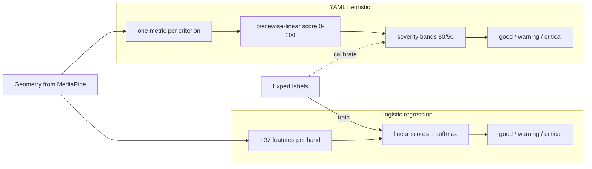

# Offline learned scorer — multinomial logistic regression

**Status:** Offline trainer landed; production still uses YAML heuristics. Hold-out macro **0.622** (Sep 2026 local compare) — **below** heuristic **0.689** on the same split; do not serve until that gate clears.  
**Last updated:** 2026-09-21  
**Companions:** [`ML_UPGRADE.md`](./ML_UPGRADE.md), [`SCORING_METHODS.md`](./SCORING_METHODS.md), [`data/README.md`](../data/README.md)

This document explains **what** the offline classical ML scorer does, **how**
the math works, and **why** it strengthens the project. For CLI commands and
pipeline order, see [`ML_UPGRADE.md`](./ML_UPGRADE.md) and
[`data/README.md`](../data/README.md).

Implementation: `src/technique_titan/ml/train.py`, `predict.py`, `features.py`.

---

## Problem statement

For each criterion (wrist height, finger curvature, thumb position, wrist
lateral, hand arch), we have:

- A **feature vector** **x** — numbers describing hand geometry from MediaPipe
  landmarks.
- An expert label **y** ∈ {`good`, `warning`, `critical`} from `data/labels.csv`.

The **heuristic** path maps geometry to severity in two steps:

1. Map one raw metric to a 0–100 score using piecewise-linear bands in
   `config/scoring.yaml` (`score_metric` in `scoring.py`).
2. Bucket that score: ≥ 80 → good, ≥ 50 → warning, else critical
   (`severity_bands` in `scoring.yaml`).

**Multinomial logistic regression** learns a direct mapping:

```
x  →  P(y = good | x), P(y = warning | x), P(y = critical | x)
```

It predicts the class with the highest probability. That is **softmax
regression**: one linear model per class, combined so the three probabilities
sum to 1.

---

## Core math

### Linear scores per class

For three severity classes, the model learns a weight vector **w**<sub>c</sub>
and bias *b*<sub>c</sub> for each class *c*:

```
z_c = w_c · x + b_c
```

In this repo, **x** has ~37 features (raw geometry, derived terms, hand
one-hot). Each **w**<sub>c</sub> is a learned vector saying how much each
feature pushes toward that class.

Example intuition for wrist height: if `wrist_height_delta` is very negative,
weights for `critical` may be large and positive on that feature while `good`
weights are negative — low wrist pushes toward `critical`.

### Softmax → probabilities

Raw scores become probabilities:

```
              exp(z_c)
P(y = c | x) = ─────────────────────────
               Σ_c' exp(z_c')
```

Properties:

- All three probabilities are positive and sum to 1.
- The model is **comparative**: it asks which class fits this geometry best,
  not whether one scalar crosses a threshold.
- Decision regions are separated by **linear boundaries** in feature space
  (where two classes tie).

### Training: maximum likelihood + L2

Given labeled pairs (x<sub>i</sub>, y<sub>i</sub>) from the **train split
only**, scikit-learn minimizes **cross-entropy loss**:

```
L = − Σ_i log P(y = y_i | x_i)
```

With L2 regularization (`C=1.0` in `train.py`), large weights are penalized so
the model does not overfit noise in a small dataset:

```
L_total = L + (1 / 2C) Σ_c ‖w_c‖²
```

`class_weight="balanced"` up-weights rare classes (e.g. few `critical`
examples) so the model does not always predict `good`.

---

## Feature vector (what x contains)

The model never sees raw images. The path is:

```
landmarks → geometry metrics → feature vector x → logistic regression → severity
```

From `ml/features.py`, each CSV row becomes:

| Feature group | Examples | Role |
|---|---|---|
| Raw geometry | `wrist_height_delta`, joint angles, `hand_arch_ratio`, … | Direct measurements |
| Derived | `*_outside_ideal`, `*_outside_ideal_sq`, `*_abs_center_dev` | Make YAML-style bands linearly separable |
| One-hot | `hand_left`, `hand_right` | Left vs right effects |

Then sklearn runs:

1. **Median imputer** — fill missing values (NaNs from bad detections).
2. **StandardScaler** — zero mean, unit variance per feature.
3. **LogisticRegression** — fit the softmax model (`solver="lbfgs"`, `max_iter=2000`).

Scores, severities, and label columns are **not** included in **x** — only
geometry and derived terms.

---

## Derived features and YAML bands

YAML scoring defines a **good in the middle** shape per criterion. Wrist height
from `config/scoring.yaml`:

```yaml
ideal: [-0.05, 0.20]   # score = 100 inside here
limit: [-0.40, 0.60]   # score = 0 at/beyond edges
```

Conceptually:

```
score
100 |     ████████
    |    /        \
  0 |___/          \___
      limit   ideal   limit
```

A plain linear model on **one raw metric** *x* can only draw a straight line —
it cannot represent “good in the middle” well. That is why `derived_from_row()`
in `features.py` adds:

```python
outside = max(0, ideal_lo - x) + max(0, x - ideal_hi)   # distance outside ideal band
outside_sq = outside ** 2
abs_center_dev = abs(x - center)                          # distance from band center
```

With these terms, a **linear** classifier can approximate the YAML’s piecewise
shape — and go further by using joint angles, arch ratio, and hand side in the
same decision.

**Bridge:** YAML encodes 1-D piecewise rules; derived features + logistic
regression encode multi-dimensional, data-driven rules in the same spirit.

---

## Five separate models

We train **one classifier per criterion**, not one model for all five labels.

| Reason | Detail |
|---|---|
| Different drivers | Wrist height cares about `wrist_height_delta`; finger curvature cares about PIP/DIP angles. |
| Independent labels | A hand can be `good` on arch but `critical` on wrist lateral — matches expert labeling. |
| Small data | One multi-label model would need more examples to learn all correlations. |
| Explainability | Inspect weights per criterion; see which features matter for each. |

Tradeoff: models ignore correlations between criteria (e.g. collapsed arch with
bad wrist height). Acceptable at this stage.

If a train slice has only one severity class for a criterion, training falls
back to `DummyClassifier(constant=that_class)`.

---

## Heuristic vs ML



| Aspect | YAML heuristic | Logistic regression |
|---|---|---|
| Inputs | 1 metric per criterion | Many features per criterion |
| Rule source | Hand-tuned `ideal` / `limit` | Learned from expert labels |
| Decision surface | Fixed 1-D bands | Linear boundaries in feature space |
| Cross-feature reasoning | No (each criterion isolated) | Yes (angles + curvature + confidence together) |
| Hand asymmetry | Same bands for L/R | Can learn `hand_left` / `hand_right` effects |

---

## What it adds to the project

### 1. Data-calibrated decisions

YAML defaults are starting points (`config/scoring.yaml` notes this). Logistic
regression **fits boundaries to `labels.csv`**, so “warning vs critical”
reflects what experts actually said, not what seemed reasonable in a config
file. Supports **NFR-ACC-2** (≥ 85% agreement): measure on frozen hold-out,
improve with evidence.

### 2. Multi-feature reasoning

Heuristics: wrist height score depends only on `wrist_height_delta`. ML: the
wrist-height model can use joint angles, arch ratio, and detection confidence
together. Modest benefit at ~33 real images; grows as labels grow.

### 3. Honest evaluation loop

`data/eval/holdout_split.json` splits by **filename** (stratified by severity
folder). Train never sees hold-out files. Compare heuristic vs ML on the same
hold-out with accuracy and Cohen’s κ — avoids tuning YAML until everything
“looks good.”

### 4. Upgrade path without architecture change

Same geometry pipeline, same explainable features. Add labels → retrain → check
κ. Keep YAML as fallback if ML is uncertain or models are missing (PRD §3.3).

### 5. What it does not do yet

| Limit | Detail |
|---|---|
| Offline only | Production API/live UI still uses YAML. |
| Still linear | Arbitrary curved boundaries need more features or a different model. |
| Small N | ~33 real images + synthetic companion rows; hold-out κ is the truth teller. |
| No uncertainty gate | Outputs a class, not “51% warning.” |
| No temporal model | Each frame/hand is independent. |

Reliability gain today is mainly **methodological** (calibrated, evaluable,
multi-feature), not “ML is already better in production.”

---

## Concrete example

For one training hand, features might include:

- `wrist_height_delta = 0.35` (high wrist)
- `wrist_height_delta_outside_ideal = 0.15` (above ideal band `[-0.05, 0.20]`)
- `confidence = 0.92`
- `hand_right = 1`

The model computes z<sub>critical</sub>, z<sub>warning</sub>, z<sub>good</sub>
from weighted sums of these features, then softmax. If experts often labeled
high wrist + high `outside_ideal` as `warning`, training pushes weights so
P(warning) wins — even if YAML would bucket differently after the 80/50 step.

---

## End-to-end offline loop

```sh
# 1. Real images → geometry + heuristic severities
python -m technique_titan.batch.process_folder \
  --input data/raw --output data/processed --labels data/labels.csv

# 2. Synthetic companion rows for f* labeled paths (no real images)
python -m technique_titan.ml.synthetic \
  --labels data/labels.csv --output data/synthetic/feature_rows.csv

# 3. Train on train split only → config/models/*.joblib
python -m technique_titan.ml.train \
  --labels data/labels.csv \
  --summary data/processed/batch_summary.csv \
  --synthetic data/synthetic/feature_rows.csv \
  --output config/models

# 4. Compare heuristic vs ML on hold-out
python -m technique_titan.eval --scorer compare \
  --summary data/processed/batch_summary.csv \
  --synthetic data/synthetic/feature_rows.csv \
  --labels data/labels.csv \
  --split data/eval/holdout_split.json \
  --models config/models \
  --output data/eval/reports
```

Eval joins predictions to labels (`eval/labels.py`), tags train vs hold-out
(`eval/split.py`), and reports per-criterion accuracy, Cohen’s κ, and confusion
matrices (`eval/evaluate.py`).

---

## Summary

**Multinomial logistic regression learns, from expert labels, how to combine
geometry features into class probabilities for good / warning / critical —
replacing hand-tuned 1-D YAML thresholds with a data-driven, multi-feature
decision rule benchmarked on a frozen hold-out.**

Further reading:

- Heuristic formulas: [`SCORING_METHODS.md`](./SCORING_METHODS.md)
- ML roadmap and constraints: [`ML_UPGRADE.md`](./ML_UPGRADE.md)
- Data layout and CLI: [`data/README.md`](../data/README.md)
