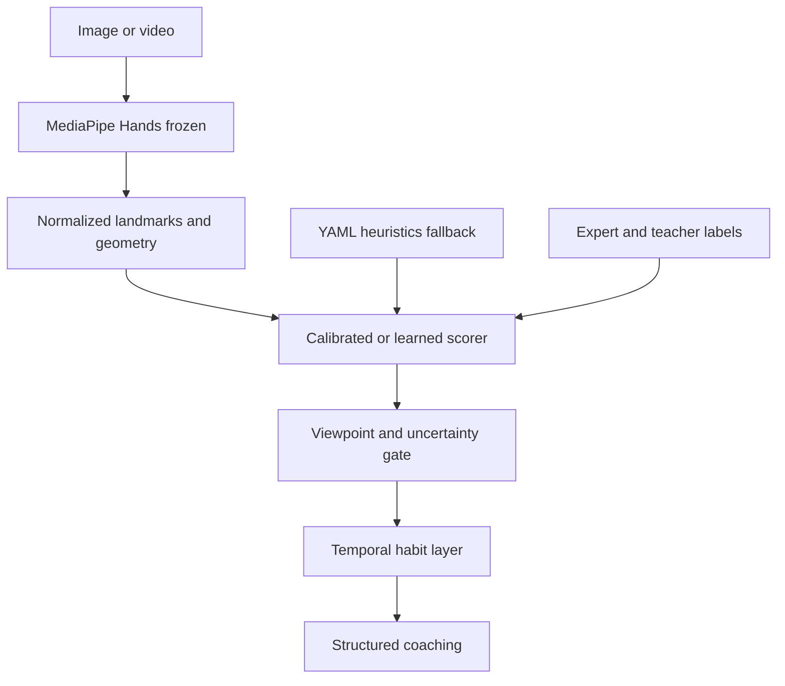

# Technique Titan — ML Upgrade Path

**Status:** Evaluation loop shipped and baselined. Offline logistic regression shipped; production still uses YAML heuristics only.
**Last updated:** 2026-09-21
**Companions:** [`PRD.md`](./PRD.md) (Phase 4, NFR-ACC-2, FR-SC-6), [`ROADMAP.md`](./ROADMAP.md) (Phase 4), [`SCORING_METHODS.md`](./SCORING_METHODS.md), [`ML_LOGISTIC_REGRESSION.md`](./ML_LOGISTIC_REGRESSION.md), [`data/README.md`](../data/README.md)

This document is the source of truth for making the engine more AI/ML without
throwing away explainable geometry. Detection is already neural (MediaPipe).
Everything after that — features, scores, coaching — is geometry plus YAML.
Phase 4 should **learn the mapping from geometry to teacher judgment**, not
replace MediaPipe on a few dozen photos.

---

## Current baseline (factual)

| Fact | Value |
|---|---|
| Trained models in-repo | Offline joblib artifacts in `config/models/` (regenerate with `python -m technique_titan.ml.train`). MediaPipe Hands remains frozen and off-the-shelf. Production scoring still uses YAML heuristics. |
| Expert-labeled rows | `data/labels.csv` — **33** real paths under `data/raw/` (Notion export) plus **82** companion `f*` rows used for synthetic feature augmentation (same CSV). Geometry table: `data/synthetic/feature_rows.csv` |
| Frozen hold-out | **10** real-image ids in `data/eval/holdout_split.json` (`f*` paths stay train-only) |
| Scoring | Piecewise-linear 1-D map per criterion in `config/scoring.yaml` |
| Coaching | Templates in `config/coaching.yaml` (not an LLM) |
| Hold-out metric in CI | Eval harness **unit tests** via pytest (`tests/engine/test_eval.py`, `tests/engine/test_ml.py`). Full agreement numbers are **local** — needs gitignored `data/raw/`, `data/processed/batch_summary.csv`, and optional `data/synthetic/feature_rows.csv` |
| Measured heuristic hold-out (Sep 2026) | **Macro accuracy 0.689**, Cohen's κ **0.103** on the 10 frozen real-image hold-out files (36 matched hand-rows from batch). Target NFR-ACC-2 remains **≥ 85%** — not met |
| Temporal state | None — each frame is scored independently |

**Today**

Image / video → MediaPipe Hands (frozen) → 21 landmarks → normalize → five
geometric metrics → piecewise-linear score from `scoring.yaml` → template tip
from `coaching.yaml`.

Known physical gaps:

- Wrist lateral uses MCP axes as a **forearm proxy** (no true forearm line).
- Wrist height is vs. the **knuckles**, not the keyboard.
- No viewpoint gate: a top-down shot can still produce a wrist-height score.

**Target after the ML loop**

Same landmarks as features → calibrated / learned scorer with uncertainty →
viewpoint gate → temporal habit layer → structured coaching. Heuristics remain
the documented fallback (PRD §3.3). Labels grow via teacher corrections. Every
change reports agreement on a frozen validation split.



---

## Build order

Each phase needs the previous one. Skipping to a custom vision model fails on
data volume and throws away explainability (PRD FR-SC-6).

| # | Phase | When | Why | Work |
|---|---|---|---|---|
| 1 | Evaluation loop | **Shipped** (Sep 2026) | Cannot promote ML until heuristics are measured on a frozen split | `technique_titan.eval`, `holdout_split.json`, `notebooks/scoring_tuning.ipynb`, promote YAML only when hold-out rises |
| 2 | Learned scoring | **Offline shipped**; **production gate open** | YAML bands are a 1-D guess; ML must beat hold-out heuristics before serving | `technique_titan.ml.{synthetic,train,predict}`; `--scorer compare`. **Next:** beat **0.689** hold-out macro on real images, then wire API fallback |
| 3 | Temporal intelligence | After Phase 3b or in parallel | Every frame is independent today; habits live in time | Landmark smoothing, dwell detection, session-level habit classifier |
| 4 | Piano-specific vision | After scoring is calibrated | MediaPipe is generic | Key-plane detection, Pose/Holistic forearm, viewpoint rejector |

Phase 2–4 are the ML half of Roadmap Phase 4. Teacher/student roles and
persistence remain the product half of that phase (see [`ROADMAP.md`](./ROADMAP.md)).

---

## Concrete upgrades, ranked

| Priority | Upgrade | ML depth | Data needed | Why it matters |
|---|---|---|---|---|
| Do now | Re-batch + re-eval after every Notion export | Eval | 33 real + growing | **85** label rows still lack batch predictions until `process_folder` covers every path; keep reports fresh |
| Do now | Grow **real** expert labels (not only `f*` companions) | Labeling | Target 80–100 real photos | Hold-out is only 10 images; κ stays near chance until the set grows |
| Done (iterate) | Calibrate `scoring.yaml` from labels | Classical | Current set | First promotion **2026-09-19** (train-only search): hold-out macro **0.622 → 0.689** |
| Shipped (gate) | Tabular severity model on features | Supervised | Labels + `feature_rows.csv` | Offline logistic regression trained; **hold-out macro 0.622** with full feature table — **does not beat YAML yet**. Keep YAML on the serving path |
| First models | Viewpoint / quality rejector | Small classifier | ~100 frames tagged by angle | PRD open Q1. Stops scoring wrist height from a top-down shot |
| First models | Temporal smoothing + habit dwell | Signal / HMM | A few labeled clips | Live mode currently forgets the last frame |
| Perception | Key-plane + forearm (Pose) | CV features | None to start | Makes wrist height and lateral deviation physically correct |
| Later | Uncertainty on every score | Calibration | Hold-out set | Suppress coaching when the model is guessing |
| Later | Teacher-correction flywheel | Active learning | Accounts (Phase 3b) | Only realistic path to a large piano-specific set |

---

## Do not do these yet

| Tempting idea | Why it is the wrong next step |
|---|---|
| Fine-tune a hand detector on `data/raw` | 33 images cannot beat MediaPipe. You will overfit lighting and camera angle |
| End-to-end CNN from pixels to score | Kills explainability (FR-SC-6) and needs thousands of labels we do not have |
| LLM as the scorer | Non-deterministic, untestable, expensive on live 2–4 Hz. Templates stay; an LLM may rewrite copy later from structured metrics |
| Accounts before labels / eval discipline | Auth is shipped; model quality still depends on Notion labels and hold-out eval, not login |

---

## First implementation slice (shipped)

1. **Shipped:** `src/technique_titan/eval/` merges `data/processed/batch_summary.csv`
   with `data/labels.csv` (hand-aware: label `hand` left/right vs `both`),
   reports per-criterion accuracy and Cohen’s κ, writes confusion matrices, and
   scores against frozen `data/eval/holdout_split.json`.
2. **Shipped:** fit candidate `ideal` / `limit` bands in
   `notebooks/scoring_tuning.ipynb` on **TRAIN** only.
3. **Shipped (gate used once):** promote bands into `config/scoring.yaml` **only if**
   HOLD-OUT agreement rises (2026-09-19 promotion). The notebook never auto-overwrites YAML.
4. **Shipped (offline):** train sklearn logistic regression per criterion (`python -m technique_titan.ml.train`). Production still uses YAML; **do not** wire `ml_with_fallback` into the API until ML beats heuristic hold-out.

Serving uses YAML heuristics only. The next ML slice is **evidence-gated serving**, not a new architecture.

### Offline learned scorer

Each criterion is an L2-regularized multinomial logistic regression
(`StandardScaler` + `LogisticRegression`) on the geometry feature vector, plus
distance-from-ideal transforms so two-sided YAML bands stay linearly
representable. Production scoring is unchanged. Math, feature design, and
rationale: [`ML_LOGISTIC_REGRESSION.md`](./ML_LOGISTIC_REGRESSION.md).

Use the repo `.venv` (Homebrew `python3.11` does not have the package). Install
the extra (`pip install -e ".[ml]"` or `requirements-dev.txt`), then:

```sh
source .venv/bin/activate   # or: .venv/bin/python -m technique_titan.ml.train …

python -m technique_titan.ml.synthetic \
  --labels data/labels.csv \
  --output data/synthetic/feature_rows.csv

python -m technique_titan.ml.train \
  --labels data/labels.csv \
  --summary data/processed/batch_summary.csv \
  --synthetic data/synthetic/feature_rows.csv \
  --split data/eval/holdout_split.json \
  --output config/models

python -m technique_titan.eval \
  --scorer compare \
  --summary data/processed/batch_summary.csv \
  --synthetic data/synthetic/feature_rows.csv \
  --labels data/labels.csv \
  --split data/eval/holdout_split.json \
  --models config/models \
  --output data/eval/reports
```

`--summary` is optional when only the companion feature table is present. `--scorer ml` writes an ML-vs-expert report; `--scorer compare` prints heuristic vs ML side by side. Hold-out files stay the original real-image ids in `data/eval/holdout_split.json`; additional `f*` paths are train-only.

### Reproduce the agreement report

Needs Python 3.11, the package (`pip install -e .`), `data/raw/` on disk, and
an export of the Notion table to `data/labels.csv`.

```sh
python -m technique_titan.batch.process_folder \
  --input data/raw \
  --output data/processed \
  --labels data/labels.csv

python -m technique_titan.eval \
  --summary data/processed/batch_summary.csv \
  --labels data/labels.csv \
  --split data/eval/holdout_split.json \
  --output data/eval/reports
```

Then open `notebooks/scoring_tuning.ipynb` for TRAIN threshold search. Copy
approved bands into `config/scoring.yaml` only after HOLD-OUT accuracy / κ
improves versus the current YAML. Reports land in `data/eval/reports/`
(gitignored). CI must not run this MediaPipe batch: `data/raw` is gitignored.

NFR-ACC-2 (≥85%) is still a **target**, not a result. The authoritative measured
heuristic hold-out macro after the 2026-09-19 YAML promotion is **0.689**
(reproduce with the commands above; artifacts under `data/eval/reports/`, gitignored).

---

## Indicative timeline (ML track)

Assumes one builder, part-time labeling, and product work on Phase 3b in parallel.
Durations are estimates, not commitments.

| Window | Milestone | Exit criteria |
|---|---|---|
| **Now – 2 weeks** | Labeling + batch hygiene | Export Notion → `labels.csv`; full batch; heuristic hold-out macro documented after each promotion |
| **2 – 6 weeks** | Heuristic calibration loop | Per-criterion hold-out accuracy improves toward **0.85**; confusion matrices show which criteria fail (today: `hand_arch`, `wrist_lateral`) |
| **Gate** | Production ML | `--scorer compare` shows ML **≥ heuristic** hold-out macro on **real-image** hold-out rows only; then implement `ml_with_fallback` in API + tests |
| **4 – 8 weeks** (after gate or parallel) | Viewpoint / quality rejector | ~100 angle-tagged frames; unsuitable views flagged, not scored |
| **6 – 10 weeks** | Temporal habit layer | Smoothing + dwell on live/video; optional session aggregates once Phase 3b persistence exists |
| **Phase 4+** | Piano-specific perception | Key plane + forearm line; wrist metrics reference keyboard/forearm, not proxies |

Teacher/student roles and exportable session reports are **product** Phase 4 items
([`ROADMAP.md`](./ROADMAP.md)); they depend on Phase 3b persistence more than on
the offline trainer.

---

## Constraints to keep

- **Heuristics remain the fallback** (PRD §3.3). A learned scorer augments;
  it does not silently replace YAML.
- **Explainability stays** (FR-SC-6). Feature-based models and calibrated
  thresholds are compatible; pixel-to-score nets are not, until we can still
  show the geometric measurement.
- **Python 3.11**, MediaPipe `0.10.21`, NumPy `<2` — do not unpin these to
  chase a newer training stack on the serving path. Training extras can live
  in a separate optional dependency group.
- **Labels stay in Notion** (`techniquetitan`) and export to `data/labels.csv`
  for batch/eval. See [`data/README.md`](../data/README.md) and [`AGENTS.md`](../AGENTS.md).
- **No media retention** until accounts exist (NFR-SEC-1). Eval uses the
  existing labeled `data/raw/` set, not production uploads. Do not commit
  `data/processed/` or `data/eval/reports/`. Keep `data/eval/holdout_split.json`
  tracked.

---

## Definition of done (ML track)

| Criterion | Status |
|---|---|
| Frozen hold-out split + reproducible CLI / notebook agreement report | **Done** — `data/eval/holdout_split.json`, `python -m technique_titan.eval`, `notebooks/scoring_tuning.ipynb` |
| Heuristic severity agreement ≥ 85% on hold-out (NFR-ACC-2) | **Not met** — macro **0.689** after 2026-09-19 YAML promotion |
| Learned scorer ≥ heuristics on hold-out, YAML fallback wired in API | **Not met** — offline trainer **done**; ML hold-out macro **0.622** on full feature table (Sep 2026 local run); **no API wiring** |
| Viewpoint-unsuitable frames rejected or flagged | **Not started** |
| Live/video reports habits beyond a single frame | **Not started** |
