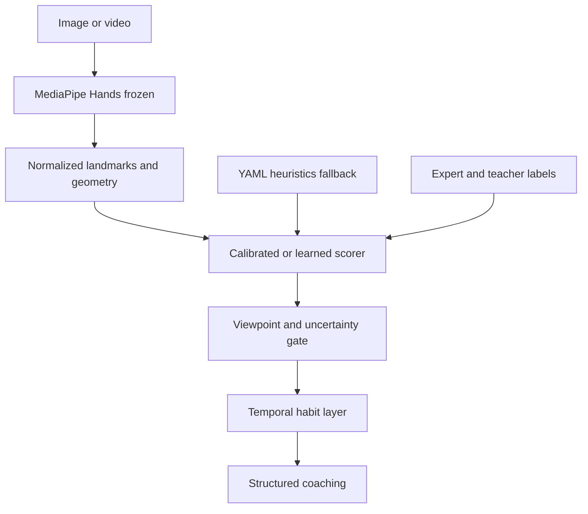

# Technique Titan — ML Upgrade Path

**Status:** Evaluation loop landed. Offline learned scoring (logistic regression) landed; production still uses YAML heuristics.
**Last updated:** 2026-09-18
**Companions:** [`PRD.md`](./PRD.md) (Phase 4, NFR-ACC-2, FR-SC-6), [`ROADMAP.md`](./ROADMAP.md) (Phase 4), [`SCORING_METHODS.md`](./SCORING_METHODS.md), [`data/README.md`](../data/README.md)

This document is the source of truth for making the engine more AI/ML without
throwing away explainable geometry. Detection is already neural (MediaPipe).
Everything after that — features, scores, coaching — is geometry plus YAML.
Phase 4 should **learn the mapping from geometry to teacher judgment**, not
replace MediaPipe on a few dozen photos.

---

## Current baseline (factual)

| Fact | Value |
|---|---|
| Trained models in-repo | Offline joblib artifacts in `config/models/` (regenerate with `python -m technique_titan.ml.train`). MediaPipe Hands remains frozen and off-the-shelf. Production scoring still uses YAML heuristics. |
| Expert-labeled images | `data/labels.csv` (Notion table `techniquetitan` plus additional `fexcellent/` / `fgood/` / `fwarning/` / `fcritical/` rows). Companion geometry table: `data/synthetic/feature_rows.csv` |
| Scoring | Piecewise-linear 1-D map per criterion in `config/scoring.yaml` |
| Coaching | Templates in `config/coaching.yaml` (not an LLM) |
| Hold-out metric in CI | Eval harness **unit tests** via pytest (`tests/`). Full agreement report is **local** — it needs `data/processed` from gitignored `data/raw` |
| Temporal state | None — each frame is scored independently |

**Today**

Image / video → MediaPipe Hands (frozen) → 21 landmarks → normalize → five
geometric metrics → piecewise-linear score from `scoring.yaml` → template tip
from `coaching.yaml`.

Known physical gaps:

- Wrist lateral uses MCP axes as a **forearm proxy** (no true forearm line).
- Wrist height is vs. the **knuckles**, not the keyboard.
- No viewpoint gate: a top-down shot can still produce a wrist-height score.

**Target after the ML loop**

Same landmarks as features → calibrated / learned scorer with uncertainty →
viewpoint gate → temporal habit layer → structured coaching. Heuristics remain
the documented fallback (PRD §3.3). Labels grow via teacher corrections. Every
change reports agreement on a frozen validation split.



---

## Build order

Each phase needs the previous one. Skipping to a custom vision model fails on
data volume and throws away explainability (PRD FR-SC-6).

| # | Phase | When | Why | Work |
|---|---|---|---|---|
| 1 | Evaluation loop | In progress (this slice) | Cannot claim a piano-specific model until heuristics lose to a hold-out set | Agreement report vs `labels.csv`, confusion matrices, threshold search in `notebooks/scoring_tuning.ipynb` |
| 2 | Learned scoring | Offline slice landed | YAML `ideal`/`limit` ranges are a 1-D guess | Per-criterion L2 logistic regression on geometry features. Heuristics stay as the production fallback |
| 3 | Temporal intelligence | Once live/video is the product | Every frame is independent today; habits live in time | Landmark smoothing, dwell detection, session-level habit classifier |
| 4 | Piano-specific vision | After scoring is calibrated | MediaPipe is generic | Key-plane detection, Pose/Holistic forearm, viewpoint rejector |

Phase 2–4 are the ML half of Roadmap Phase 4. Teacher/student roles and
persistence remain the product half of that phase (see [`ROADMAP.md`](./ROADMAP.md)).

---

## Concrete upgrades, ranked

| Priority | Upgrade | ML depth | Data needed | Why it matters |
|---|---|---|---|---|
| Do now | Heuristic vs expert agreement report | Eval | Current 33 + more | Harness landing. Unblocks measuring NFR-ACC-2 (≥85%). Proves what is already wrong |
| Do now | Calibrate `scoring.yaml` from labels | Classical | Current set | Tuning notebook exists; thresholds are still starting guesses |
| First models | Tabular severity model on features | Supervised | Current labels + companion feature table | Offline logistic regression landed. Keep YAML on the serving path |
| First models | Viewpoint / quality rejector | Small classifier | ~100 frames tagged by angle | PRD open Q1. Stops scoring wrist height from a top-down shot |
| First models | Temporal smoothing + habit dwell | Signal / HMM | A few labeled clips | Live mode currently forgets the last frame |
| Perception | Key-plane + forearm (Pose) | CV features | None to start | Makes wrist height and lateral deviation physically correct |
| Later | Uncertainty on every score | Calibration | Hold-out set | Suppress coaching when the model is guessing |
| Later | Teacher-correction flywheel | Active learning | Accounts (Phase 3b) | Only realistic path to a large piano-specific set |

---

## Do not do these yet

| Tempting idea | Why it is the wrong next step |
|---|---|
| Fine-tune a hand detector on `data/raw` | 33 images cannot beat MediaPipe. You will overfit lighting and camera angle |
| End-to-end CNN from pixels to score | Kills explainability (FR-SC-6) and needs thousands of labels we do not have |
| LLM as the scorer | Non-deterministic, untestable, expensive on live 2–4 Hz. Templates stay; an LLM may rewrite copy later from structured metrics |
| Accounts before an eval harness | Persistence helps the product, not the model. Labels and agreement come first |

---

## First implementation slice

1. **Landing:** `src/technique_titan/eval/` merges `data/processed/batch_summary.csv`
   with `data/labels.csv` (hand-aware: label `hand` left/right vs `both`),
   reports per-criterion accuracy and Cohen’s κ, writes confusion matrices, and
   scores against frozen `data/eval/holdout_split.json`.
2. **Landing:** fit candidate `ideal` / `limit` bands in
   `notebooks/scoring_tuning.ipynb` on **TRAIN** only.
3. **Landing (gate):** promote those bands into `config/scoring.yaml` **only if**
   HOLD-OUT agreement rises. The notebook never auto-overwrites YAML.
4. **Landing (offline):** train a sklearn logistic regression per criterion on the exported feature vector (`python -m technique_titan.ml.train`). Production still uses YAML; do not wire `ml_with_fallback` into the API yet.

That is the start of an ML project. A new architecture is not. Serving still uses the evaluation loop plus YAML heuristics; the learned scorer is offline until a follow-up slice.

### Offline learned scorer

Each criterion is an L2-regularized multinomial logistic regression
(`StandardScaler` + `LogisticRegression`) on the geometry feature vector, plus
distance-from-ideal transforms so two-sided YAML bands stay linearly
representable. Production scoring is unchanged.

Install the extra (`pip install -e ".[ml]"` or `requirements-dev.txt`), then:

```sh
python -m technique_titan.ml.synthetic \
  --labels data/labels.csv \
  --output data/synthetic/feature_rows.csv

python -m technique_titan.ml.train \
  --labels data/labels.csv \
  --summary data/processed/batch_summary.csv \
  --synthetic data/synthetic/feature_rows.csv \
  --split data/eval/holdout_split.json \
  --output config/models

python -m technique_titan.eval \
  --scorer compare \
  --summary data/processed/batch_summary.csv \
  --synthetic data/synthetic/feature_rows.csv \
  --labels data/labels.csv \
  --split data/eval/holdout_split.json \
  --models config/models \
  --output data/eval/reports
```

`--summary` is optional when only the companion feature table is present. `--scorer ml` writes an ML-vs-expert report; `--scorer compare` prints heuristic vs ML side by side. Hold-out files stay the original real-image ids in `data/eval/holdout_split.json`; additional `f*` paths are train-only.

### Reproduce the agreement report

Needs Python 3.11, the package (`pip install -e .`), `data/raw/` on disk, and
an export of the Notion table to `data/labels.csv`.

```sh
python -m technique_titan.batch.process_folder \
  --input data/raw \
  --output data/processed \
  --labels data/labels.csv

python -m technique_titan.eval \
  --summary data/processed/batch_summary.csv \
  --labels data/labels.csv \
  --split data/eval/holdout_split.json \
  --output data/eval/reports
```

Then open `notebooks/scoring_tuning.ipynb` for TRAIN threshold search. Copy
approved bands into `config/scoring.yaml` only after HOLD-OUT accuracy / κ
improves versus the current YAML. Reports land in `data/eval/reports/`
(gitignored). CI must not run this MediaPipe batch: `data/raw` is gitignored.

There is no measured hold-out ≥85% figure in-repo yet (NFR-ACC-2 remains a
target, not a result).

---

## Constraints to keep

- **Heuristics remain the fallback** (PRD §3.3). A learned scorer augments;
  it does not silently replace YAML.
- **Explainability stays** (FR-SC-6). Feature-based models and calibrated
  thresholds are compatible; pixel-to-score nets are not, until we can still
  show the geometric measurement.
- **Python 3.11**, MediaPipe `0.10.21`, NumPy `<2` — do not unpin these to
  chase a newer training stack on the serving path. Training extras can live
  in a separate optional dependency group.
- **Labels stay in Notion** (`techniquetitan`) and export to `data/labels.csv`
  for batch/eval. See [`data/README.md`](../data/README.md) and [`AGENTS.md`](../AGENTS.md).
- **No media retention** until accounts exist (NFR-SEC-1). Eval uses the
  existing labeled `data/raw/` set, not production uploads. Do not commit
  `data/processed/` or `data/eval/reports/`. Keep `data/eval/holdout_split.json`
  tracked.

---

## Definition of done (ML track)

None of the following is complete. The eval harness is the first slice only.

- Frozen hold-out split and an agreement report that a documented CLI /
  notebook can reproduce (harness landing; full report is local, not CI).
- Heuristic severity agreement measured against expert labels (target ≥85%,
  NFR-ACC-2) — not yet reported on hold-out.
- Learned scorer meets or exceeds heuristics on that split, with YAML
  fallback wired and tested — **offline trainer landed; production fallback
  not wired yet**.
- Viewpoint-unsuitable frames are rejected or flagged rather than scored as
  confident technique errors.
- Live/video can report a habit that lasts more than one frame.
